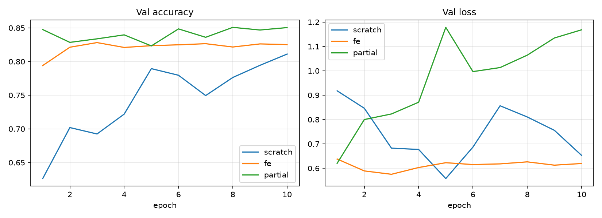

# Swarm Drone — Transfer Learning untuk Persepsi Visual Antar-Drone

RET503 Computer Vision and Deep Learning · Pertemuan 3 (Transfer Learning) · Politeknik Negeri Batam

## Tujuan
Klasifikasi crop objek udara menjadi `drone` / `bird` / `background` sebagai modul persepsi swarm:
mengenali drone tetangga dari kamera onboard dan menolak false positive (burung, langit, latar).
Output classifier dimaksudkan sebagai *gate* setelah detektor (mis. YOLO), bukan pengganti kontrol penerbangan.

## Dataset
- **Bird vs Drone** (Kaggle: `stealthknight/bird-vs-drone`, format YOLO, 640×640, gambar dari frame video, disegmentasi dan diaugmentasi).
  Lihat halaman Kaggle untuk sitasi lengkap.
- Label dataset ini **semuanya berisi id 0**, jadi kelas diambil dari awalan nama file (`B*` = bird, `D*` = drone).
  Label campuran polygon/bbox dikonversi ke bbox, lalu di-crop (padding 15%). Kelas `background` = crop acak tanpa overlap objek.
- Train di-subsample **8.000 crop per kelas**. Val: 737 bird / 1.040 drone / 1.273 background. Test: 378 / 526 / 638.
- **Belum ada data dari kamera drone proyek** (lihat Batasan).

## Metode
ResNet-18 (ImageNet), input 224×224, Adam + cosine LR, 10 epoch, batch 32, seed 42, augmentasi flip/rotasi/color jitter.

| Mode | Yang dilatih | LR |
|---|---|---|
| scratch | semua layer, tanpa pretrained (baseline) | 1e-3 |
| fe | `fc` saja (feature extraction) | 1e-3 |
| partial | `layer4` + `fc` (fine-tuning parsial) | 1e-4 / 1e-3 |

BatchNorm pada layer beku dipaksa `eval()`; optimizer hanya menerima parameter `requires_grad=True`.

## Hasil


| Mode | Trainable params | Best val acc | Test acc | Waktu total (s) |
|---|---|---|---|---|
| scratch | 11.178.051 | 0,8111 | 0,9702 | 586 |
| fe | 1.539 | 0,8282 | 0,9410 | 809 |
| partial | 8.395.267 | **0,8508** | **0,9929** | 926 |

- `partial` terbaik di val maupun test. Checkpoint dipilih dari val acc, bukan test.
- Kolom waktu **tidak sebanding**: bottleneck ada di CPU (decode + augmentasi) dan sebagian run terganggu (laptop mati, beban lain).
- Semua angka dari satu run dan satu seed, jadi selisih kecil antar mode (mis. `fe` vs `scratch` di val) belum tentu bermakna.

## Temuan: gap val vs test
Model `partial`, per kelas (`python analyze_gap.py --mode partial`):

| Recall | Val | Test |
|---|---|---|
| drone | 0,997 | 1,000 |
| background | 0,878 | 0,984 |
| bird | **0,600** | 0,997 |

- Selisih val (85,1%) vs test (99,3%) hampir seluruhnya berasal dari kelas `bird` di val: 284 burung diprediksi `background`
  dan 151 `background` diprediksi `bird`. Kelas `drone`, yang paling penting untuk swarm, stabil di kedua split.
- Ukuran crop **tidak** menjelaskan gap ini (sisi-min median bird: train 196, val 289, test 289 px).
- Kemiripan fitur ke crop train terdekat sedikit lebih tinggi di test (median 0,969 vs 0,963 di val). Selisihnya kecil dan
  metrik ini tanpa baseline, jadi **tidak cukup untuk menyimpulkan kebocoran**.
- Penyebab belum dipastikan. Hipotesis: (1) burung di val berasal dari adegan/latar yang tidak ada di train, (2) polygon label val
  tidak menutupi burung sehingga crop berisi langit, (3) test punya kembaran mirip di train. Crop yang salah disimpan di `errors/val/`
  untuk inspeksi visual.
- Karena dataset berasal dari frame video, test 99% **tidak boleh dianggap performa lapangan**.

## Batasan
- Belum ada data dari kamera drone proyek. Ini langkah berikutnya, dengan split per sesi terbang (bukan per frame) agar tidak bocor.
- Domain dataset: gambar siang hari dari Pexels. Kondisi malam/IR, blur gerak, dan jarak jauh belum diuji.
- Satu seed, satu run per mode.

## Struktur repo
```
prepare_dataset.py   YOLO (bbox/polygon) -> folder klasifikasi
train.py             --mode scratch|fe|partial
compare.py           -> results.md, compare.png
analyze_gap.py       diagnosa val vs test + simpan crop yang salah
runs/<mode>/         history.json, report.txt, classes.json (best.pt hanya untuk partial)
```

## Reproduksi
```bash
python3 -m venv venv && source venv/bin/activate
pip install -r requirements.txt
python prepare_dataset.py --src <folder Dataset berisi train/valid/test> --dst data
# (opsional) subsample train ke 8000 crop per kelas: hapus sisanya di data/train/<kelas>/
python train.py --mode scratch --epochs 10 --workers 8
python train.py --mode fe      --epochs 10 --workers 8
python train.py --mode partial --epochs 10 --workers 8
python compare.py
python analyze_gap.py --mode partial
```
